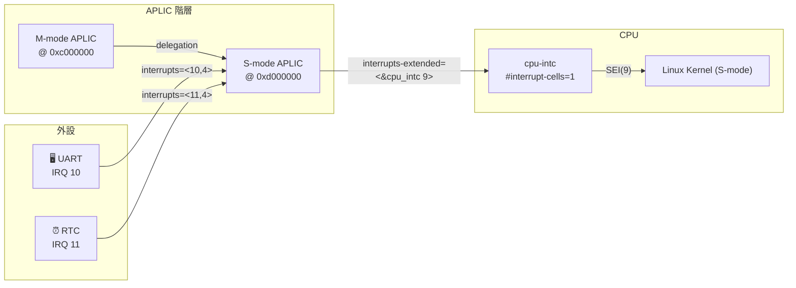
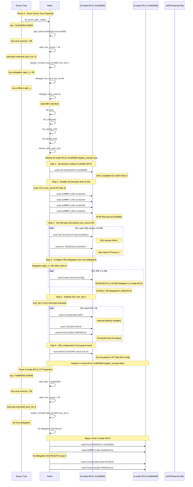
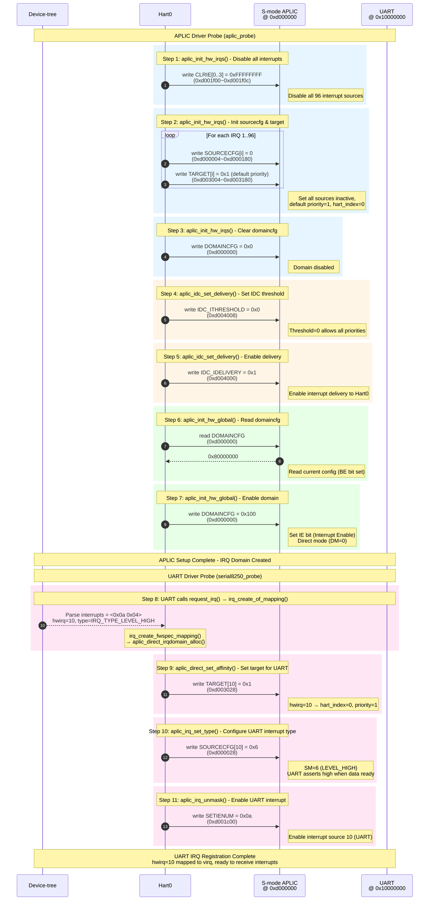
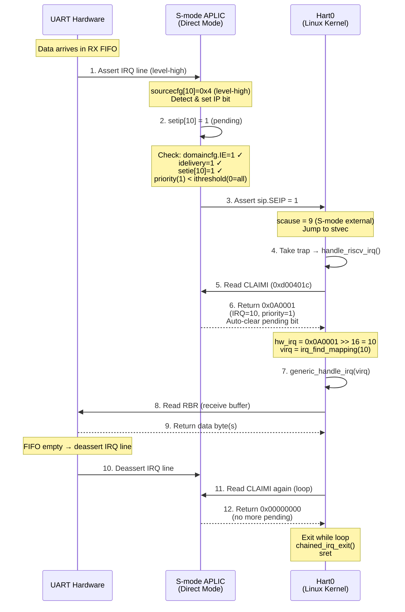

AIA 適用於多種使用情境，包含有線中斷（Wired Interrupt）、訊息信號中斷（MSI），並且支援虛擬化功能。以下表格整理自 AIA 主要貢獻者針對 AIA 演講主題[^1]中的內容。

| Platforms | M-level MSIs | S-level MSIs | VS-level MSIs | M-level Wired Interrupts | S-level Wired Interrupts | VS-level Wired Interrupts | M-level IPIs | S-level IPIs | VS-level IPIs | M-level Timer | S-level Timer | VS-level Timer |
| :--- | :---: | :---: | :---: | :---: | :---: | :---: | :---: | :---: | :---: | :---: | :---: | :---: |
| **Legacy Wired IRQs** | NA | NA | NA | PLIC | PLIC | PLIC (Emulate) | <font color="green">MSWI (CLINT)</font> | <font color="red">SBI IPI</font> | <font color="red">SBI IPI</font> | <font color="green">MTIMER (CLINT)</font> | <font color="red">SBI Timer</font> | <font color="red">SBI Timer</font> |
| **Only Wired IRQs** | NA | NA | NA | <font color="blue">APLIC M-level</font> | <font color="blue">APLIC S-level</font> | <font color="blue">APLIC S-level (Emulate)</font> | <font color="green">MSWI</font> | <font color="green">SSWI</font> | <font color="red">SBI IPI</font> | <font color="green">MTIMER</font> | <font color="brown">Priv Sstc</font> | <font color="brown">Priv Sstc</font> |
| **MSIs and Wired IRQs** | <font color="blue">IMSIC M-file</font> | <font color="blue">IMSIC S-file</font> | <font color="blue">IMSIC S-file (Emulate)</font> | <font color="blue">APLIC M-level</font> | <font color="blue">APLIC S-level</font> | <font color="blue">APLIC S-level (Emulate)</font> | <font color="blue">IMSIC M-file</font> | <font color="blue">IMSIC S-file</font> | <font color="red">SBI IPI</font> | <font color="green">MTIMER</font> | <font color="brown">Priv Sstc</font> | <font color="brown">Priv Sstc</font> |
| **MSIs, Virtual MSIs and Wired IRQs** | <font color="blue">IMSIC M-file</font> | <font color="blue">IMSIC S-file</font> | <font color="blue">IMSIC VS-file</font> | <font color="blue">APLIC M-level</font> | <font color="blue">APLIC S-level</font> | <font color="blue">APLIC S-level (Emulate)</font> | <font color="blue">IMSIC M-file</font> | <font color="blue">IMSIC S-file</font> | <font color="blue">IMSIC VS-file</font> | <font color="green">MTIMER</font> | <font color="brown">Priv Sstc</font> | <font color="brown">Priv Sstc</font> |

<font color="blue">■ RISC-V AIA 規格</font> · <font color="green">■ RISC-V ACLINT 規格</font> · <font color="red">■ RISC-V SBI 規格</font> · <font color="brown">■ RISC-V 特權規格</font>

## 使用情境 - 簡單有線中斷

最簡單的使用情境為上表的 "Only Wired IRQs"。
根據 RISC-V 進階中斷架構（AIA）規格及相關的 Linux 核心文件，以下說明使用 APLIC 直接傳遞模式（Direct Delivery Mode，有線中斷，無 IMSIC）的系統架構。
在此配置中，APLIC 透過專用線路直接連接到 CPU。雖然機器模式（M-mode）韌體（如 OpenSBI）通常負責初始設定與委派，但運行在監管者模式（S-mode）的 Linux 會直接與 S-mode APLIC 中斷域（Interrupt Domain）互動，以配置和處理這些中斷，而無需在每次事件時陷入 M-mode。


### QEMU 執行環境

使用 QEMU (v10.1.0) 啟動單核心 virt 機器，並啟用 APLIC 作為中斷控制器：

```bash
qemu-system-riscv64 -M virt,aia=aplic -smp 1 \
    -bios fw_jump.bin -kernel Image \
    -append "rootwait root=/dev/vda ro" \
    -drive file=rootfs.ext2,format=raw \
    -nographic
```

> 參數說明：
> - `-M virt,aia=aplic`：使用 virt 機器類型，並指定 AIA 模式為 APLIC（直接傳遞模式，無 IMSIC）
> - `-smp 1`：單核心配置，簡化中斷路由分析

開機進入 Linux shell 後，可透過 `/proc/interrupts` 確認中斷控制器為 `APLIC-DIRECT`：

```bash
$ cat /proc/interrupts
           CPU0
 10:        675 RISC-V INTC   5 Edge      riscv-timer
 12:        176 APLIC-DIRECT  33 Level     virtio1
 13:        181 APLIC-DIRECT  10 Level     ttyS0
 14:         20 APLIC-DIRECT   8 Level     virtio0
 15:          0 APLIC-DIRECT  11 Level     101000.rtc
IPI0:         0  Rescheduling interrupts
IPI1:         0  Function call interrupts
IPI2:         0  CPU stop interrupts
IPI3:         0  CPU stop (for crash dump) interrupts
IPI4:         0  IRQ work interrupts
IPI5:         0  Timer broadcast interrupts
IPI6:         0  CPU backtrace interrupts
IPI7:         0  KGDB roundup interrupts
```

### 裝置樹（Device Tree）格式

在直接傳遞模式下，APLIC 裝置樹節點的特徵是具有 `interrupts-extended` 屬性（定義連接到 CPU 的輸出線路），且不存在 `msi-parent` 屬性。

```c
aplic_m: interrupt-controller@c000000 {
    compatible = "qemu,aplic", "riscv,aplic";
    // [必要] 相容性字串
    // 第一個是廠商特定 (qemu,aplic)，第二個是通用 (riscv,aplic)
    riscv,delegation = <&aplic_s 1 96>;
    // [選用] 中斷委派列表
    // 格式: <子域 phandle, 起始中斷號, 結束中斷號>
    // &aplic_s = 子 APLIC (S-mode) 的參考
    // 1 = 第一個中斷號 (inclusive)
    // 96 = 最後一個中斷號 (inclusive)
    // 表示將中斷 1~96 委派給 S-mode APLIC 處理
    riscv,children = <&aplic_s>;
    // [選用] 子 APLIC 域列表
    // &aplic_s = 指向 S-mode APLIC
    // 註: 如果有 riscv,delegation，則此屬性為必要 (dependency)
    riscv,num-sources = <96>;
    // [必要] 支援的中斷源數量: 96 個
    reg = <0x00 0xc000000 0x00 0x8000>;
    // [必要] 暫存器映射: 基底 0xc000000, 大小 32KB
    interrupts-extended = <&cpu0_intc 11>;
    // [Direct Mode 必要] 中斷注入目標
    // &cpu0_intc = CPU0 的中斷控制器
    // 11 = M-mode external interrupt (MEI)
    interrupt-controller;
    // [必要] 中斷控制器標記
    #interrupt-cells = <2>;
    // [必要] 每個中斷描述需要 2 個 cell
    // (通常是: 中斷號碼 + 中斷類型/觸發方式)
    #address-cells = <0>;
    // [選用] 表示此中斷控制器的子節點不需要地址 cell
    // (binding 中未明確定義，但常見於中斷控制器)
};

aplic_s: interrupt-controller@d000000 {
    compatible = "qemu,aplic", "riscv,aplic";
    // [必要] 相容性字串，標識此設備類型
    // 第一個是廠商特定 (qemu,aplic)，第二個是通用 (riscv,aplic)
    riscv,num-sources = <96>;
    // [必要] 指定此 APLIC 域支援的有線中斷源數量
    // 96 個中斷源 (最大可支援 1023)
    reg = <0x00 0xd000000 0x00 0x8000>;
    // [必要] APLIC 暫存器的記憶體映射位址
    // 基底位址: 0xd000000, 大小: 0x8000 (32KB)
    interrupts-extended = <&cpu0_intc 9>;
    // [Direct Mode 必要] 指定此 APLIC 域直接注入外部中斷到哪些 RISC-V HART
    // &cpu0_intc = CPU0 的中斷控制器 (riscv,cpu-intc)
    // 9 = S-mode external interrupt (SEI)
    // *註: interrupts-extended 或 msi-parent 至少需要其中一個
    interrupt-controller;
    // [必要] 標記此節點為中斷控制器
    #interrupt-cells = <2>;
    // [必要] 指定描述一個中斷需要 2 個 cell
    // (通常是: 中斷號碼 + 中斷類型/觸發方式)
    #address-cells = <0>;
    // [選用] 表示此中斷控制器的子節點不需要地址 cell
    // (binding 中未明確定義，但常見於中斷控制器)
};
```

裝置樹所呈現的階層式 APLIC 中斷域邏輯:



> RISC-V QEMU virt machine 的 IRQ 編號可以在 [include/hw/riscv/virt.h](https://github.com/qemu/qemu/blob/ece408818d27f745ef1b05fb3cc99a1e7a5bf580/include/hw/riscv/virt.h#L93-L101) 找到

### 中斷單元與來源裝置（Interrupt Cells and Source Devices）

`#interrupt-cells = <2>` 屬性定義了當其他裝置引用此 APLIC 中斷控制器時，需要使用多少個 cell 來描述一個中斷。在 APLIC 中，這兩個 cell 的意義如下：

| Cell | 說明 |
| :--- | :--- |
| Cell 1 | 中斷來源編號（Interrupt Source Number），對應 APLIC 的輸入中斷線編號（1 到 `riscv,num-sources`） |
| Cell 2 | 觸發類型旗標（Trigger Type Flags），定義中斷的觸發方式 |

以下透過實際的裝置樹節點來說明來源裝置如何引用 APLIC。

#### RTC 節點分析

```c
rtc@101000 {
   interrupts = <0x0b 0x04>;
   //            │     └─── cell 2: 中斷類型 = 4 = IRQ_TYPE_LEVEL_HIGH
   //            └───────── cell 1: 中斷號碼 = 11
   interrupt-parent = <&aplic_s>;
   //                   └─────────── 指定此設備的中斷連接到 S-mode APLIC
   reg = <0x00 0x101000 0x00 0x1000>;
   compatible = "google,goldfish-rtc";
};
```

#### Serial 節點分析

```c
serial@10000000 {
   interrupts = <0x0a 0x04>;
   //            │     └─── cell 2: 中斷類型 = 4 = IRQ_TYPE_LEVEL_HIGH
   //            └───────── cell 1: 中斷號碼 = 10
   interrupt-parent = <&aplic_s>;
   //                   └─────────── 指定此設備的中斷連接到 S-mode APLIC

   clock-frequency = <0x384000>;
   reg = <0x00 0x10000000 0x00 0x100>;
   compatible = "ns16550a";
};
```

> 中斷類型參考 (來自 [include/dt-bindings/interrupt-controller/irq.h](https://elixir.bootlin.com/linux/v6.18.6/source/include/dt-bindings/interrupt-controller/irq.h))
> 
> | 數值 | 名稱 | 說明 |
> |------|------|------|
> | 0 | IRQ_TYPE_NONE | 未指定 |
> | 1 | IRQ_TYPE_EDGE_RISING | 上升沿觸發 |
> | 2 | IRQ_TYPE_EDGE_FALLING | 下降沿觸發 |
> | 3 | IRQ_TYPE_EDGE_BOTH | 雙邊沿觸發 |
> | 4 | IRQ_TYPE_LEVEL_HIGH | 高電平觸發 ← 這裡使用 |
> | 8 | IRQ_TYPE_LEVEL_LOW | 低電平觸發 |


## QEMU 追蹤 APLIC 配置（有線中斷模式）

本節說明如何透過 QEMU 追蹤功能觀察 APLIC 的 MMIO 暫存器存取，以理解 APLIC 簡單有線中斷模式下的關鍵暫存器配置流程。

首先，我們需要對 QEMU v10.1.0 套用一個補丁 [qemu-v10.1.0-aplic-trace.patch](../assets/aia/qemu-v10.0.0-aplic-trace.patch)，重新編譯後即可追蹤 APLIC 相關操作。

啟動 QEMU 時加入以下參數以開啟追蹤：

```bash
qemu-system-riscv64 ... -d int -trace "riscv_aplic_*" -D qemu.log
```

> 參數說明：
> - `-d int`：啟用中斷事件的除錯輸出
> - `-trace "riscv_aplic_*"`：追蹤所有 APLIC 相關的 MMIO 存取[^2]
> - `-D qemu.log`：將追蹤輸出導向 `qemu.log` 檔案

在另一個終端機視窗中，使用以下指令即時監控 APLIC MMIO 存取與外部中斷事件：

```
$ tail -f qemu.log | grep --line-buffered -E "riscv_aplic|external" | nl
1 riscv_aplic_write [hart0@0x80044686] write 0xd000000 = 0x0
2 riscv_aplic_write [hart0@0x80044686] write 0xd001f00 = 0xffffffff
3 riscv_aplic_write [hart0@0x80044686] write 0xd001f04 = 0xffffffff
4 riscv_aplic_write [hart0@0x80044686] write 0xd001f08 = 0xffffffff
5 riscv_aplic_write [hart0@0x80044686] write 0xd001f0c = 0xffffffff
6 riscv_aplic_write [hart0@0x80044686] write 0xd000004 = 0x0
...
```

## 1. M-mode APLIC 初始化（OpenSBI v1.8）

這些追蹤紀錄有助於定位 M-mode 韌體配置 APLIC 暫存器的過程，我們可以整理出以下流程圖：



### OpenSBI APLIC (Direct Mode) 配置流程摘要

#### M-mode Domain APLIC (Root)

以下是 OpenSBI 中 M-mode APLIC Direct Mode 的初始化流程：

| Step# | APLIC 暫存器 | Offset | 說明 |
|:-----:|-------------|--------|------|
| 1 | `domaincfg` | 0x0000 | 停用 APLIC：IE=0 (中斷禁用)、DM=0 (Direct Mode)、BE=0 (Little-endian) |
| 2 | `clrie[0]`~`clrie[31]` | 0x1F00~0x1F7C | 清除所有中斷源的 enable bits，確保初始化期間無中斷觸發 |
| 3 | `sourcecfg[1]`~`sourcecfg[N]` | 0x0004~0x0FFC | 將所有中斷源設為 Inactive (SM=0)，中斷源不活躍 |
| 3 | `target[1]`~`target[N]` | 0x3004~0x3FFC | 設定預設目標：Hart Index=0、Priority=1 (IPRIO 最低有效值) |
| 4 | `sourcecfg[i]` | 0x0004~0x0FFC | 若有 delegation：設定 D=1 (bit 10) 並指定 child_index，將中斷委派給子 domain (S-mode APLIC) |
| 5 | `idelivery` | IDC_BASE + h×32 + 0x00 | 停用該 hart 的中斷傳遞 |
| 5 | `iforce` | IDC_BASE + h×32 + 0x04 | 清除強制中斷旗標 |
| 5 | `ithreshold` | IDC_BASE + h×32 + 0x08 | 設定 threshold=256，遮蔽所有優先權的中斷 (priority 1~255 皆被遮蔽) |
| 6 | `mmsicfgaddrh` | 0x1BC4 | MSI 配置（跳過）：檢查 lock bit，因 DT 無 msi-parent 屬性，不進行 MSI 配置 |

#### S-mode Domain APLIC (Child/Leaf)

以下是 OpenSBI 中 S-mode APLIC Direct Mode 的初始化流程（無進一步委派，為 leaf domain）：

| Step# | APLIC 暫存器 | Offset | 說明 |
|:-----:|-------------|--------|------|
| 1 | `domaincfg` | 0x0000 | 停用 APLIC：IE=0 (中斷禁用)、DM=0 (Direct Mode)、BE=0 (Little-endian) |
| 2 | `clrie[0]`~`clrie[31]` | 0x1F00~0x1F7C | 清除所有中斷源的 enable bits，確保初始化期間無中斷觸發 |
| 3 | `sourcecfg[1]`~`sourcecfg[N]` | 0x0004~0x0FFC | 無 delegation，SOURCECFG 維持為 0（由父 domain 委派過來的中斷源會自動生效） |
| 3 | `target[1]`~`target[N]` | 0x3004~0x3FFC | 設定預設目標：Hart Index=0、Priority=1 (IPRIO 最低有效值) |
| 4 | - | - | Leaf domain：無子 domain，跳過 delegation 設定 |
| 5 | `idelivery` | IDC_BASE + h×32 + 0x00 | 停用該 hart 的中斷傳遞 |
| 5 | `iforce` | IDC_BASE + h×32 + 0x04 | 清除強制中斷旗標 |
| 5 | `ithreshold` | IDC_BASE + h×32 + 0x08 | 設定 threshold=256，遮蔽所有優先權的中斷 (priority 1~255 皆被遮蔽) |
| 6 | `mmsicfgaddrh` | 0x1BC4 | MSI 配置（跳過）：檢查 lock bit，因 DT 無 msi-parent 屬性，不進行 MSI 配置 |

> IDC Base Address: 0x4000，每個 IDC 結構大小為 32 bytes

簡單總結 M-mode (OpenSBI) 的準備工作：

1. 停用並重置 APLIC：將 domaincfg 設為 0，確保初始化期間 APLIC 不會產生中斷
2. 清除所有中斷 enable bits：透過 clrie 暫存器禁用所有中斷源
3. 設定中斷源為 Inactive：所有 sourcecfg 設為 0
4. 委派中斷給 S-mode：若 DT 中有 riscv,delegation 屬性，將指定範圍的中斷源委派給 S-mode APLIC (設定 sourcecfg 的 D bit 和 child_index)
5. 初始化 IDC：停用中斷傳遞 (idelivery=0)、設定高 threshold (ithreshold=0x100) 遮蔽所有中斷

## 2. S-mode APLIC 初始化（Linux v6.19）

同樣的追蹤手法，可繪製出以下序列圖展示 RISC-V APLIC 中斷控制器在 Linux 開機時的初始化流程：
首先停用所有中斷源並設定預設優先級 (Step 1-3)，接著啟用 per-hart IDC 中斷傳遞 (Step 4-5)，最後啟用 Domain (Step 6-7)。當 UART 驅動載入時，透過 `request_irq()` 註冊 hwirq 10 (Step 8-9)，設定觸發類型為 `LEVEL_HIGH` (Step 10) 並啟用該中斷源 (Step 11)。



### RISC-V APLIC Direct Mode 中斷觸發排查清單

在 Direct Mode 下，中斷要成功傳遞到 Hart，必須滿足以下**所有**條件。當中斷預期觸發但未觸發時，可依此清單逐一檢查。

| # | 暫存器 | 功能說明 | 預期值 | Linux (v6.19) 原始碼 |
|---|--------|----------|--------|--------------|
| 1 | `sstatus.SIE` | Hart 全域中斷啟用 | `1` | [arch/riscv/include/asm/irqflags.h#L19-L22](https://github.com/torvalds/linux/blob/v6.19/arch/riscv/include/asm/irqflags.h#L19-L22) |
| 2 | `sie.SEIE` | Hart S-mode 外部中斷啟用 (bit 9) | `1` | [drivers/irqchip/irq-riscv-intc.c#L60-L66](https://github.com/torvalds/linux/blob/v6.19/drivers/irqchip/irq-riscv-intc.c#L60-L66) |
| 3 | APLIC `domaincfg.IE` | APLIC Domain 全域中斷啟用 | `1` | [drivers/irqchip/irq-riscv-aplic-main.c#L103-L108](https://github.com/torvalds/linux/blob/v6.19/drivers/irqchip/irq-riscv-aplic-main.c#L103-L108) |
| 4 | APLIC `idelivery` | 該 Hart 的 IDC 中斷傳遞啟用 | `1` | [drivers/irqchip/irq-riscv-aplic-direct.c#L171](https://github.com/torvalds/linux/blob/v6.19/drivers/irqchip/irq-riscv-aplic-direct.c#L171) |
| 5 | APLIC `ithreshold` | 該 Hart 的 IDC 優先級門檻 | `0` (允許所有優先級) | [drivers/irqchip/irq-riscv-aplic-direct.c#L168](https://github.com/torvalds/linux/blob/v6.19/drivers/irqchip/irq-riscv-aplic-direct.c#L168) |
| 6 | APLIC `setienum` / `setie` | 個別中斷源啟用 | 對應 bit = `1` | [drivers/irqchip/irq-riscv-aplic-main.c#L19-L24](https://github.com/torvalds/linux/blob/v6.19/drivers/irqchip/irq-riscv-aplic-main.c#L19-L24) |
| 7 | APLIC `setipnum` / `setip` / 硬體觸發 | 中斷 pending 狀態 | 對應 bit = `1` | [include/linux/irqchip/riscv-aplic.h#L89-L90](https://github.com/torvalds/linux/blob/v6.19/include/linux/irqchip/riscv-aplic.h#L89-L90) |
| 8 | APLIC `sourcecfg[i]` | 中斷源觸發模式設定 | 非 `0` (inactive) | [drivers/irqchip/irq-riscv-aplic-main.c#L33-L64](https://github.com/torvalds/linux/blob/v6.19/drivers/irqchip/irq-riscv-aplic-main.c#L33-L64) |
| 9 | APLIC `target[i]` | 中斷目標 Hart 與優先級 | hart_index + priority | [drivers/irqchip/irq-riscv-aplic-direct.c#L69-L72](https://github.com/torvalds/linux/blob/v6.19/drivers/irqchip/irq-riscv-aplic-direct.c#L69-L72) |

#### GDB 除錯指令

```gdb
# 檢查 Hart CSRs
p/x $sstatus    # 確認 bit 1 (SIE) = 1
p/x $sie        # 確認 bit 9 (SEIE) = 1
p/x $sip        # 確認 bit 9 (SEIP) = 1 表示有 pending 外部中斷

# 檢查 APLIC 暫存器 (以 S-mode APLIC @ 0xd000000 為例)
# domaincfg
x/1wx 0xd000000

# idelivery (IDC base = 0xd004000)
x/1wx 0xd004000

# ithreshold
x/1wx 0xd004008

# 檢查 hwirq=10 (UART) 的設定
# sourcecfg[10] = base + 0x04 + (10-1)*4 = 0xd000028
x/1wx 0xd000028

# target[10] = base + 0x3004 + (10-1)*4 = 0xd003028
x/1wx 0xd003028

# setie (檢查 bit 10 是否為 1)
# setie[0] = base + 0x1e00 = 0xd001e00
x/1wx 0xd001e00

# setip (檢查 bit 10 是否為 1，表示 pending)
# setip[0] = base + 0x1c00 = 0xd001c00
x/1wx 0xd001c00
```

## 3. 執行時期有線中斷處理（以 UART 為例）

以下圖展示 UART 中斷處理流程：當 UART 收到資料，透過 APLIC 觸發 Hart0 外部中斷，Kernel 讀取 APLIC `CLAIMI` 暫存器取得 hwirq 10，執行 UART handler 讀取資料。讀取後 UART 解除中斷線，`CLAIMI` 回傳 0 結束以下的 `aplic_direct_handle_irq()` 處理迴圈。

<iframe frameborder="0" scrolling="no" style="width:100%; height:309px;" allow="clipboard-write" src="https://emgithub.com/iframe.html?target=https%3A%2F%2Fgithub.com%2Ftorvalds%2Flinux%2Fblob%2Fv6.19%2Fdrivers%2Firqchip%2Firq-riscv-aplic-direct.c%23L147-L157&style=default&type=code&showBorder=on&showLineNumbers=on&showFileMeta=on&showFullPath=on&showCopy=on"></iframe>



## 附錄：有線中斷模式關鍵暫存器列表

在有線中斷模式（非 MSI 模式）下，以下總結出 APLIC 的關鍵 MMIO 暫存器可供速查：

### 域配置暫存器（Domain Configuration）

| 暫存器 | 讀取行為 | 寫入行為 | 用途 |
|--------|----------|----------|------|
| `DOMAINCFG` | 回傳域配置 | 設定 IE, DM, BE 位元 | 域層級的中斷總開關 |

```
 31      24 23                     9   8  7        3  2    1    0
┌──────────┬────────────────────────┬────┬──────────┬────┬────┬────┐
│ 0x80     │      Reserved (0)      │ IE │ Rsvd (0) │ DM │ (0)│ BE │
│ (r/o)    │                        │    │          │    │    │    │
└──────────┴────────────────────────┴────┴──────────┴────┴────┴────┘
    │                                 │               │         │
    │                                 │               │         └─ Big Endian
    │                                 │               └─ Delivery Mode 0 = direct mode 
    │                                 │                                1 = MSI mode
    │                                 └─ Interrupt Enable
    └─ 0x80 (read-only, 用於判斷 byte order)
```

### 中斷來源配置暫存器（Source Configuration）

| 暫存器 | 讀取行為 | 寫入行為 | 用途 |
|--------|----------|----------|------|
| `SOURCECFG[1..1023]` | 回傳 sourcecfg[irq] | 設定來源模式（邊緣/電位觸發） | 配置各中斷來源的委派或觸發方式 |

| Offset | Register | IRQ |
|--------|----------|-----|
| 0x0004 | sourcecfg[1] | IRQ 1 |
| 0x0008 | sourcecfg[2] | IRQ 2 |
| 0x000C | sourcecfg[3] | IRQ 3 |
| ... | ... | ... |
| 0x0FFC | sourcecfg[1023] | IRQ 1023 |


暫存器格式（取決於 D bit）

#### 模式一：D=1（委派給子 Domain）

```
 31                          11  10   9                         0
┌──────────────────────────────┬────┬────────────────────────────┐
│        Reserved (0)          │ D  │       Child Index          │
│                              │ =1 │                            │
└──────────────────────────────┴────┴────────────────────────────┘
                                 │              │
                                 │              └─ bits 9:0: 子 domain 索引
                                 └─ bit 10 = 1: 委派模式
```

| 欄位 | Bits | 說明 |
|------|------|------|
| D | 10 | = 1，表示委派給子 domain |
| Child Index | 9:0 | 目標子 domain 的索引 |

#### 模式二：D=0（本 Domain 處理）

```
 31                          11  10   9       3   2           0
┌──────────────────────────────┬────┬──────────┬───────────────┐
│        Reserved (0)          │ D  │ Rsvd (0) │      SM       │
│                              │ =0 │          │               │
└──────────────────────────────┴────┴──────────┴───────────────┘
                                 │                    │
                                 │                    └─ bits 2:0: Source Mode
                                 └─ bit 10 = 0: 本 domain 處理
```

| 欄位 | Bits | 說明 |
|------|------|------|
| D | 10 | = 0，表示本 domain 處理此中斷 |
| SM | 2:0 | Source Mode（中斷觸發類型） |

SM (Source Mode) 編碼

| 值 | 名稱 | 說明 |
|----|------|------|
| 0 | Inactive | 中斷源不活躍（停用） |
| 1 | Detached | 活躍但與輸入線分離（用於接收 MSI） |
| 2 | - | Reserved |
| 3 | - | Reserved |
| 4 | Edge1 | 上升沿觸發（low → high） |
| 5 | Edge0 | 下降沿觸發（high → low） |
| 6 | Level1 | 高電位觸發 |
| 7 | Level0 | 低電位觸發 |

### 中斷目標暫存器（Interrupt Target）

| 暫存器 | 讀取行為 | 寫入行為 | 用途 |
|--------|----------|----------|------|
| `TARGET[1..1023]` | 回傳 target[irq] | 設定 hart 索引 + 優先權 | 指定中斷目標 CPU 及優先權 |

* Direct Mode (`domaincfg.DM = 0`)

```
 31       18 17          8 7            0
┌───────────┬─────────────┬──────────────┐
│Hart Index │ Reserved(0) │    IPRIO     │
│  (14-bit) │  (10-bit)   │   (8-bit)    │
└───────────┴─────────────┴──────────────┘
      │                          │
      │                          └─ 中斷優先權 (1~255, 數字越小優先權越高)
      └─ 目標 Hart 索引 (0~16383)
```

* MSI Mode (`domaincfg.DM = 1`)

```
 31       18 17     12 11          0
┌───────────┬─────────┬──────────────┐
│Hart Index │ Guest   │    EIID      │
│  (14-bit) │  Index  │   (11-bit)   │
│           │ (6-bit) │              │
└───────────┴─────────┴──────────────┘
      │          │            │
      │          │            └─ External Interrupt ID (寫入 IMSIC 的值)
      │          └─ Guest 索引 (用於虛擬化，0=supervisor level)
      └─ 目標 Hart 索引
```

欄位說明

| 模式 | 欄位 | Bits | 說明 |
|------|------|------|------|
| **Direct & MSI** | Hart Index | 31:18 | 目標 hart 索引 (WLRL) |
| **Direct** | IPRIO | 7:0 | 中斷優先權，1=最高，不可為 0 |
| **MSI** | Guest Index | 17:12 | Guest interrupt file 索引 (H 擴展) |
| **MSI** | EIID | 10:0 | 寫入 IMSIC 的中斷識別碼 |

### 中斷待處理暫存器（Interrupt Pending）

| 暫存器 | 讀取行為 | 寫入行為 | 用途 |
|--------|----------|----------|------|
| `SETIP[0..31]` | 回傳待處理位元字組 | 設定待處理位元 | 設定中斷為待處理狀態 |
| `SETIPNUM` | 回傳待處理位元字組 | 以中斷號設定待處理 | 透過寫入中斷號設定待處理 |
| `CLRIP[0..31]` | 回傳輸入字組 | 清除待處理位元 | 清除中斷待處理狀態 |
| `CLRIPNUM` | 回傳輸入字組 | 以中斷號清除待處理 | 透過寫入中斷號清除待處理 |

### 中斷啟用暫存器（Interrupt Enable）

| 暫存器 | 讀取行為 | 寫入行為 | 用途 |
|--------|----------|----------|------|
| `SETIE[0..31]` | 回傳啟用位元字組 | 設定啟用位元 | 啟用特定中斷 |
| `SETIENUM` | 回傳啟用位元字組 | 以中斷號設定啟用 | 透過寫入中斷號啟用中斷 |
| `CLRIE[0..31]` | 回傳 0 | 清除啟用位元 | 停用特定中斷 |
| `CLRIENUM` | 回傳 0 | 以中斷號清除啟用 | 透過寫入中斷號停用中斷 |

### 中斷傳遞控制暫存器（IDC - Interrupt Delivery Control）

每個 hart 都有一組獨立的 IDC 暫存器

| 暫存器 | 讀取行為 | 寫入行為 | 用途 |
|--------|----------|----------|------|
| `IDC.idelivery` | 回傳 idelivery[idc] | 設定傳遞啟用 | 啟用/停用中斷傳遞至該 hart |
| `IDC.iforce` | 回傳 iforce[idc] | 設定強制位元 | 強制產生中斷（測試用） |
| `IDC.ithreshold` | 回傳 ithreshold[idc] | 設定優先權門檻 | 設定中斷優先權門檻值 |
| `IDC.topi` | 回傳最高待處理中斷 | 唯讀 | 查詢最高優先權待處理中斷 |
| `IDC.claimi` | 回傳並認領中斷 | 唯讀 | 認領（claim）中斷以進行處理 |

[^1]: [Advanced Interrupt Architecture and Advanced CLINT - Anup Patel & John Hauser](https://youtu.be/je9Qr23mclU?t=1152)
[^2]: QEMU (v10.1.0) source code: `riscv_aplic_read` [hw/intc/riscv_aplic.c:629](https://elixir.bootlin.com/qemu/v10.1.0/source/hw/intc/riscv_aplic.c#L629-L728); `riscv_aplic_write` [hw/intc/riscv_aplic.c:730](https://elixir.bootlin.com/qemu/v10.1.0/source/hw/intc/riscv_aplic.c#L730-L884)
