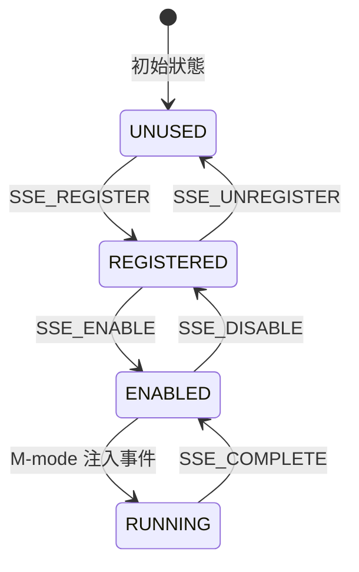
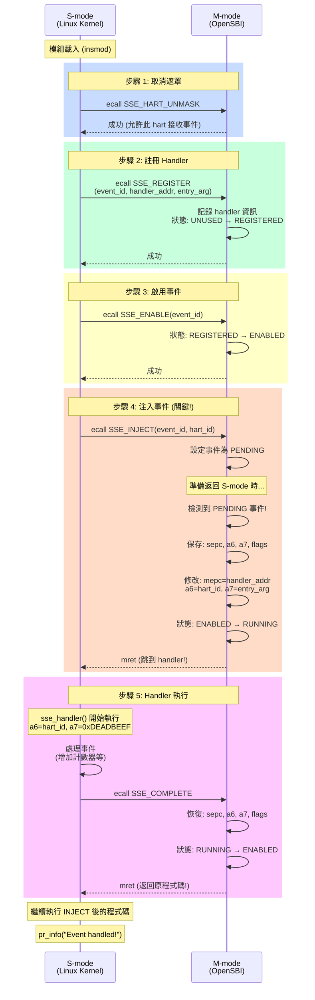
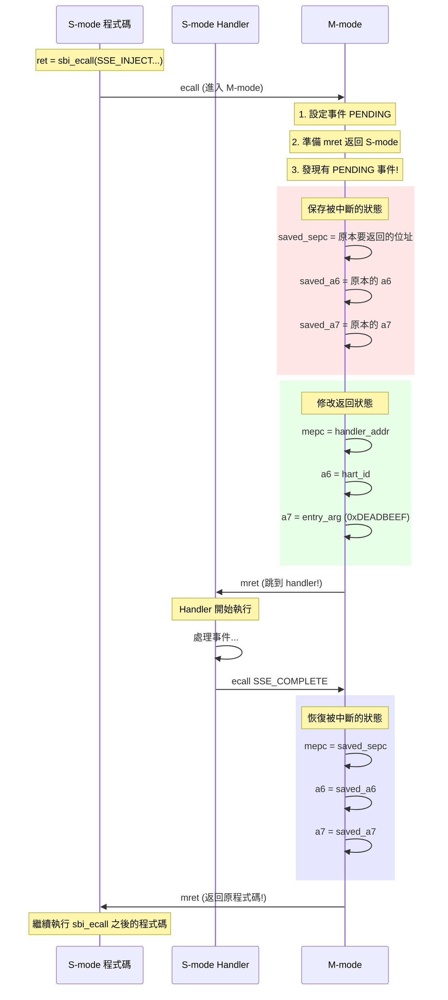

## 前言

在 RISC-V 的世界裡，不同的特權等級 (Privilege Levels) 之間需要一種優雅的溝通方式。傳統上，S-mode (Supervisor mode，通常是 Linux 核心) 透過 `ecall` 向 M-mode (Machine mode，通常是 OpenSBI) 請求服務。但如果 M-mode 想要**主動通知** S-mode 發生了什麼事呢？

這就是 **SSE (Supervisor Software Events)** 登場的時候了！

## 什麼是 SSE？

SSE 是 RISC-V SBI (Supervisor Binary Interface) 規範中的一個擴展，它提供了一種機制讓 M-mode 可以**非同步地**向 S-mode 注入軟體事件。你可以把它想像成：

- **傳統 ecall**：S-mode 打電話給 M-mode 問問題
- **SSE**：M-mode 可以隨時「插話」通知 S-mode 有事情發生

### 應用場景

- **RAS (Reliability, Availability, Serviceability)**：硬體錯誤通知
- **PMU Overflow**：效能計數器溢位事件
- **軟體事件**：用於測試或自定義通知機制

## SSE 事件狀態機

每個 SSE 事件都有自己的狀態，狀態轉換如下：



## Demo 模組執行流程

下面這個 Mermaid 序列圖展示了我們的 demo 模組如何運作：



## SBI SSE 函數一覽

| 函數 ID | 名稱 | 說明 |
|---------|------|------|
| 0x00 | READ_ATTR | 讀取事件屬性 |
| 0x01 | WRITE_ATTR | 寫入事件屬性 |
| 0x02 | REGISTER | 註冊 S-mode handler |
| 0x03 | UNREGISTER | 取消註冊 |
| 0x04 | ENABLE | 啟用事件 |
| 0x05 | DISABLE | 停用事件 |
| 0x06 | COMPLETE | Handler 完成處理 |
| 0x07 | INJECT | 注入/觸發事件 |
| 0x08 | HART_UNMASK | 取消遮罩 (允許事件) |
| 0x09 | HART_MASK | 遮罩 (阻擋事件) |

## Demo 程式碼

以下是完整的 SSE demo 核心模組程式碼：

```c
// SPDX-License-Identifier: GPL-2.0-only
/*
 * SSE (Supervisor Software Events) Demo Kernel Module
 *
 * 這個範例展示如何使用 SBI SSE 擴展：
 * 1. 向 M-mode (OpenSBI) 註冊 S-mode 事件處理器
 * 2. 啟用事件
 * 3. 從 S-mode 注入事件
 * 4. 處理事件並完成
 */

#define pr_fmt(fmt) KBUILD_MODNAME ": " fmt

#include <linux/module.h>
#include <linux/kernel.h>
#include <linux/init.h>
#include <linux/cpu.h>
#include <asm/sbi.h>

/* SSE Extension ID - "SSE" 的 ASCII 十六進位 */
#define SBI_EXT_SSE			0x535345

/* SSE 函數 ID */
#define SBI_EXT_SSE_REGISTER		0x00000002
#define SBI_EXT_SSE_UNREGISTER		0x00000003
#define SBI_EXT_SSE_ENABLE		0x00000004
#define SBI_EXT_SSE_DISABLE		0x00000005
#define SBI_EXT_SSE_COMPLETE		0x00000006
#define SBI_EXT_SSE_INJECT		0x00000007
#define SBI_EXT_SSE_HART_UNMASK		0x00000008
#define SBI_EXT_SSE_HART_MASK		0x00000009

/* 本地軟體事件 - 可以從 S-mode 自己注入 */
#define SBI_SSE_EVENT_LOCAL_SOFTWARE	0xffff0000

/* 全域變數：記錄事件處理資訊 */
static volatile unsigned long sse_event_count;
static volatile unsigned long sse_last_hart_id;
static volatile unsigned long sse_last_entry_arg;

/*
 * SSE 事件處理器
 *
 * 進入時的狀態：
 *   a6 = hart_id
 *   a7 = entry_arg (註冊時傳入的參數)
 *   中斷已關閉 (SSTATUS.SIE = 0)
 *
 * 處理完畢後必須呼叫 SSE_COMPLETE！
 */
static void __naked sse_handler(void)
{
	asm volatile (
		/* 保存會用到的暫存器 */
		"addi	sp, sp, -32\n"
		"sd	t0, 0(sp)\n"
		"sd	t1, 8(sp)\n"
		"sd	t2, 16(sp)\n"
		"sd	ra, 24(sp)\n"

		/* 增加事件計數器 */
		"la	t0, sse_event_count\n"
		"ld	t1, 0(t0)\n"
		"addi	t1, t1, 1\n"
		"sd	t1, 0(t0)\n"

		/* 保存 hart_id (a6) */
		"la	t0, sse_last_hart_id\n"
		"sd	a6, 0(t0)\n"

		/* 保存 entry_arg (a7) */
		"la	t0, sse_last_entry_arg\n"
		"sd	a7, 0(t0)\n"

		/* 恢復暫存器 */
		"ld	t0, 0(sp)\n"
		"ld	t1, 8(sp)\n"
		"ld	t2, 16(sp)\n"
		"ld	ra, 24(sp)\n"
		"addi	sp, sp, 32\n"

		/* 呼叫 SSE_COMPLETE 結束處理 */
		"li	a7, 0x535345\n"		/* SBI_EXT_SSE */
		"li	a6, 0x00000006\n"	/* SSE_COMPLETE */
		"ecall\n"

		/* 不會執行到這裡 */
		"1: j	1b\n"
		::: "memory"
	);
}

/* 檢查 SSE 是否可用 */
static bool sse_probe(void)
{
	return sbi_probe_extension(SBI_EXT_SSE) > 0;
}

static int __init sse_demo_init(void)
{
	struct sbiret ret;
	unsigned long handler_addr = (unsigned long)sse_handler;
	unsigned long entry_arg = 0xDEADBEEF;
	int hart_id;

	pr_info("=== SSE Demo Module ===\n");

	/* 檢查 SSE 支援 */
	if (!sse_probe()) {
		pr_err("SSE extension not available!\n");
		return -ENODEV;
	}
	pr_info("SSE extension detected\n");

	hart_id = smp_processor_id();
	pr_info("Running on hart %d\n", hart_id);
	pr_info("Handler address: 0x%lx\n", handler_addr);

	/* 步驟 1: 取消遮罩 */
	ret = sbi_ecall(SBI_EXT_SSE, SBI_EXT_SSE_HART_UNMASK,
			0, 0, 0, 0, 0, 0);
	if (ret.error) {
		pr_err("HART_UNMASK failed: %ld\n", ret.error);
		return -EIO;
	}
	pr_info("Hart unmasked\n");

	/* 步驟 2: 註冊 handler */
	ret = sbi_ecall(SBI_EXT_SSE, SBI_EXT_SSE_REGISTER,
			SBI_SSE_EVENT_LOCAL_SOFTWARE,
			handler_addr, entry_arg, 0, 0, 0);
	if (ret.error) {
		pr_err("REGISTER failed: %ld\n", ret.error);
		goto err_mask;
	}
	pr_info("Handler registered\n");

	/* 步驟 3: 啟用事件 */
	ret = sbi_ecall(SBI_EXT_SSE, SBI_EXT_SSE_ENABLE,
			SBI_SSE_EVENT_LOCAL_SOFTWARE, 0, 0, 0, 0, 0);
	if (ret.error) {
		pr_err("ENABLE failed: %ld\n", ret.error);
		goto err_unregister;
	}
	pr_info("Event enabled\n");

	/* 步驟 4: 注入事件！ */
	pr_info("Injecting event...\n");
	ret = sbi_ecall(SBI_EXT_SSE, SBI_EXT_SSE_INJECT,
			SBI_SSE_EVENT_LOCAL_SOFTWARE, hart_id,
			0, 0, 0, 0);
	if (ret.error) {
		pr_err("INJECT failed: %ld\n", ret.error);
		goto err_disable;
	}

	/* Handler 已執行完畢！ */
	pr_info("Event handled!\n");
	pr_info("  Count: %lu\n", sse_event_count);
	pr_info("  Hart: %lu\n", sse_last_hart_id);
	pr_info("  Arg: 0x%lx\n", sse_last_entry_arg);

	return 0;

err_disable:
	sbi_ecall(SBI_EXT_SSE, SBI_EXT_SSE_DISABLE,
		  SBI_SSE_EVENT_LOCAL_SOFTWARE, 0, 0, 0, 0, 0);
err_unregister:
	sbi_ecall(SBI_EXT_SSE, SBI_EXT_SSE_UNREGISTER,
		  SBI_SSE_EVENT_LOCAL_SOFTWARE, 0, 0, 0, 0, 0);
err_mask:
	sbi_ecall(SBI_EXT_SSE, SBI_EXT_SSE_HART_MASK, 0, 0, 0, 0, 0, 0);
	return -EIO;
}

static void __exit sse_demo_exit(void)
{
	sbi_ecall(SBI_EXT_SSE, SBI_EXT_SSE_DISABLE,
		  SBI_SSE_EVENT_LOCAL_SOFTWARE, 0, 0, 0, 0, 0);
	sbi_ecall(SBI_EXT_SSE, SBI_EXT_SSE_UNREGISTER,
		  SBI_SSE_EVENT_LOCAL_SOFTWARE, 0, 0, 0, 0, 0);
	pr_info("Unloaded. Events: %lu\n", sse_event_count);
}

module_init(sse_demo_init);
module_exit(sse_demo_exit);
MODULE_LICENSE("GPL");
```

## 魔法發生的瞬間：INJECT 到 COMPLETE

讓我們仔細看看最神奇的部分 — 當 `SSE_INJECT` 被呼叫時發生了什麼：



## 重點整理

### 為什麼要用 `__naked` 函數？

因為這個 handler 不是透過正常的 `call` 指令進入的！M-mode 直接修改 `mepc` 強制跳進來，所以：
- 沒有正常的 function prologue/epilogue
- 需要自己管理暫存器
- 不能用 `return`，必須用 `SSE_COMPLETE`

### 為什麼 SSE_COMPLETE 後會繼續執行 INJECT 後面的程式碼？

因為 M-mode 在注入時保存了「原本 ecall 要返回的位址」（就是 INJECT 後的下一條指令）。當 COMPLETE 被呼叫時，M-mode 恢復這個位址，所以 `mret` 就會跳回去！

### 預設為什麼要遮罩？

這是一個安全機制。S-mode 必須**明確表示**它已經準備好接收事件，才會取消遮罩。否則在 handler 還沒註冊好的情況下收到事件，會造成未定義行為。

## 編譯與執行

```bash
# 編譯模組
make -C /path/to/linux M=samples/sse modules

# 載入模組
insmod sse_demo.ko

# 查看輸出
dmesg | grep sse_demo
```

### 預期輸出

```
sse_demo: === SSE Demo Module ===
sse_demo: SSE extension detected
sse_demo: Running on hart 0
sse_demo: Handler address: 0xffffffff80123456
sse_demo: Hart unmasked
sse_demo: Handler registered
sse_demo: Event enabled
sse_demo: Injecting event...
sse_demo: Event handled!
sse_demo:   Count: 1
sse_demo:   Hart: 0
sse_demo:   Arg: 0xdeadbeef
```

## 結語

SSE 提供了一種優雅的方式讓 M-mode 可以主動通知 S-mode。雖然我們的 demo 是從 S-mode 自己注入事件給自己（使用 `LOCAL_SOFTWARE` 事件），但在實際應用中，M-mode 可以在偵測到硬體錯誤或其他重要事件時，主動注入事件到 S-mode。

這種機制對於實現可靠的錯誤處理、效能監控等功能非常有用。希望這篇文章能幫助你理解 SSE 的運作原理！

## 參考資料

- [RISC-V SBI Specification](https://github.com/riscv-non-isa/riscv-sbi-doc)
- [OpenSBI Source Code](https://github.com/riscv-software-src/opensbi)
- Linux Kernel `arch/riscv/kernel/sbi.c`

